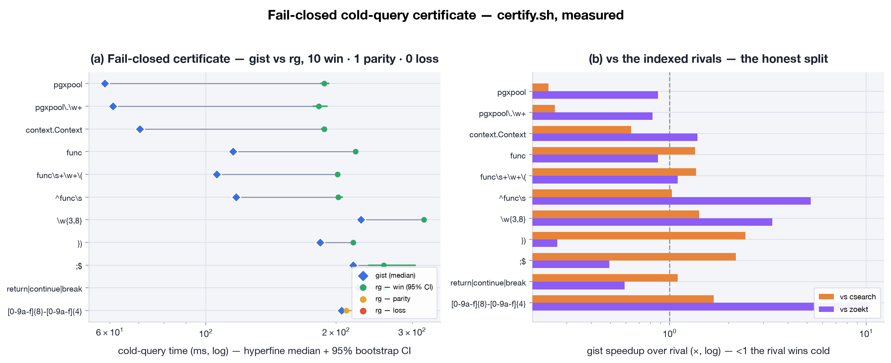

---
doc_radar:
  counts:
    - description: "thin CLI face keeps its four command packages"
      glob: pkg/kernels/irregex/src/cli/gist/*/
      equals: 4
      unit: dirs
  sentinels:
    - description: "entrypoint still exposes search, index, codex, status, and resident service"
      file: pkg/kernels/irregex/src/cli/gist/main.zig
      contains:
        - "const indexer = gist.commands.indexer;"
        - "const codex_face = gist.commands.codex;"
        - "const search = gist.commands.search;"
        - "const serve = gist.commands.serve;"
        - "const client = gist.commands.client;"
    - description: "the public flag surface still comes from one compatibility catalog"
      file: pkg/kernels/irregex/src/runtime/cold/argv/args.zig
      contains:
        - "pub const flag_catalog"
        - "supported_with_differences"
        - "accepted_but_ignored"
        - "unsupported_fail_loud"
    - description: "all three search transports remain operational"
      file: pkg/kernels/irregex/contract/search_api.toml
      contains:
        - 'subprocess = { status = "authoritative"'
        - 'uds = { status = "operational-accelerator"'
        - 'ffi = { status = "operational-accelerator"'
    - description: "the committed fail-closed certificate exists and is fail-closed"
      file: pkg/kernels/irregex/bench/certify/artifact/CERTIFICATE.md
      contains: "a win requires a lower median AND p<0.05"
---

# `gist`: indexed regex search for a live working tree

`gist` is where my bit-level idea became a tool. Text is bits; a required
trigram is a small proof that most files cannot match. Instead of reading them
all, gist rules those files out, then checks every survivor against current
bytes.

I kept ripgrep's useful mental model: pattern, paths, familiar flags, stdout
results, and 0/1/2 exit codes. Then I added three things for the agent loop:

1. a persisted candidate index that can prove most files are irrelevant —
   required trigrams, plus a crest sidecar for the class-repetition patterns
   trigrams cannot see;
2. a fail-open resident session that avoids cold startup when the request is
   eligible; and
3. a bounded, definition-biased ranked view for questions where the best hit
   matters more than every hit.

The rule is simple: the tree tells the truth. The persisted index and resident
daemon can save work, but they cannot invent a file set or return stale
content. If an accelerator cannot prove its answer is safe, gist walks the live
tree.

## Quickstart

```bash
make install-gist                    # ReleaseFast binaries, PATH link, trigram index

gist 'SearchRequest'                 # search from the current directory
gist 'SearchRequest' services -n     # explicit scope, line numbers
gist 'SearchRequest' -l              # matching paths only
gist 'SearchRequest' --rank          # best definitions and uses, default top 20
gist 'foo(?=bar)' -P                 # vendored PCRE2: lookaround/backreferences
gist 'foo(?=bar)' --engine auto      # linear first, PCRE2 only if required
gist 'begin.*end' -U                 # multiline mode
gist 'needle' --no-index             # force a pure live walk

gist status --json                  # versioned index/freshness snapshot
gist index                          # rebuild the persisted candidate index
gist serve [ROOT...]                # run the resident UDS service explicitly

gist codex build
gist codex count 'literal'           # exact corpus-wide occurrence count
gist codex tally 'literal' --top 20  # per-file counts, heaviest first
gist codex status

gist --help
gist --schema                        # machine-readable flags and compatibility
```

No index is required. Without one, `gist` scans the live tree. With a covering
index, it automatically skips files that cannot contain the query's required
trigrams and verifies every candidate against current bytes.

`gist rg …` and `gist search …` are aliases for the same search engine. The
canonical form is intentionally verbless.

## The search contract

The cold runtime's
[`flag_catalog`](../../runtime/cold/argv/args.zig) is the source of truth for both argv
handling and `gist --schema`. It separates the public surface into exact
support, support with documented differences, accepted no-ops, and unknown
flags that fail with exit 2. I do **not** claim every option ripgrep ever
shipped.

The implemented surface includes:

- regular, fixed (`-F`), smart-case (`-S`), case-insensitive (`-i`), whole-word
  (`-w`), inverted (`-v`), and multiple (`-e`/`-f`) patterns;
- Unicode-by-default case folding, character classes, properties, and word
  boundaries, with `(?-u)` or `--no-unicode` for byte/ASCII semantics;
- the linear RE2/Pike engine, vendored PCRE2 10.47 with JIT (`-P`), and
  `--engine auto` escalation;
- native multiline search (`-U`, `--multiline-dotall`);
- path, type, glob, hidden-file, symlink, depth, size, filesystem, and the full
  `.gitignore`/`.ignore`/`.rgignore` control family;
- context, only-match, count, replacement, heading, column, byte-offset,
  vimgrep, JSON Lines, null-delimited, sorted, and stats output;
- stdin, UTF BOM detection, the WHATWG encoding label set, preprocessing, and
  compressed-file search.

Normal results go to stdout. Diagnostics, timing, output-budget notices, and
no-match suggestions go to stderr. `GIST_HINTS=0` disables suggestions without
touching results.

Search exit codes follow ripgrep:

- `0`: at least one match;
- `1`: a clean search with no match;
- `2`: invalid argv, unsupported syntax, an unreadable path, or another search
  error.

An unknown flag or a pattern rejected by the selected engine is therefore an
error, never a convincing empty result.

### Deliberate differences

These are current product choices, not unfinished claims:

- The parallel walk may discover independent files in a different order.
  Explicit `--sort`/`--sortr` requests are globally ordered after parallel
  reads.
- `--binary` and `-uuu` search a binary file in full instead of emitting
  ripgrep's one-line binary summary.
- `--type-list` is formatted like ripgrep but describes gist's strict superset
  of the type registry.
- `-j` caps gist's adaptive work-stealing pool; it is not a promise to copy
  ripgrep's scheduler.
- `-z` decodes gzip, zlib, zstd, and xz in-process; less common formats use
  their standard external decoder. `--pre` passes the path as argv 1 with
  stdin closed.
- `--mmap`, `--no-mmap`, `--colors`, `--dfa-size-limit`, and
  `--regex-size-limit` are accepted compatibility no-ops. Color uses gist's
  own palette.
- Agent-facing output has a soft budget of roughly 25k tokens / 100 KiB and a
  hard 256 MiB ceiling. `--uncap` or `GIST_UNCAP=1` lifts the soft limit.

For an exact, versioned answer about a flag, inspect `gist --schema` rather
than relying on a prose list.

## Three execution paths, one answer

### Cold subprocess: authoritative

I keep the normal process as the path that can answer every request:

```text
argv → parse → compile → walk → index read-elision → verify → emit
```

The walk chooses the files. The index only removes provable non-candidates.
Files changed since the index anchor are read live; missing coverage simply
reduces acceleration. `--no-index` is the differential oracle for this
invariant.

### Resident UDS session: fail-open accelerator

To stop paying startup costs, `gist serve` holds corpus bytes and a trigram
index behind a per-repository Unix socket. The CLI may auto-spawn it after an
eligible cold miss. I keep the warm path narrow: rootless default line output
(optionally `-n`) and rootless `-l`, with the small pattern-mode subset accepted
by the request classifier. Explicit paths, stdin, TTY output, context, JSON,
ranking, replacement, multiline, and unsupported shapes stay cold.

Freshness is fail-closed. macOS FSEvents or Linux inotify can narrow the work,
but a reconcile barrier decides whether resident bytes are safe. Doubt,
overflow, an index generation change, or a walk error declines the warm answer
and returns to the subprocess. See the
[`ResidentSession`](../../runtime/session/README.md) invariant.

### In-process FFI: embedders

For embedders, the C ABI (`irregex_open` / `irregex_search` /
`irregex_close`) streams match records from the same error-returning resident
engine. Python uses it when the shared library and optional cffi are available,
then falls open to UDS or subprocess. It is another route to the same matcher,
not a second implementation.

The cross-face request and transport contract is
[`contract/search_api.toml`](../../../contract/search_api.toml).

## The two indexes do different jobs

I use two indexes because they answer different questions. The ordinary trigram
index is a **candidate filter**. It is small, mmap-backed, and fast, but every
candidate still needs its current bytes checked. This is the index behind
normal regex search. Riding beside it is the **crest sidecar**: sixteen bytes
per file recording its longest run in each byte-class, which prunes the
literal-free class repetitions (`[0-9a-f]{12}`, `[0-9]{6}`) that extract no
trigram at all. That one is my own math — a sound forced-run necessary
condition, proof and measurements in
[`research/crest/`](../../../research/crest/PROOF.md). Both filters only ever
skip reads; caseless queries, changed files, and a missing sidecar all fall
back to reading.

The codex shelf is a **compressed self-index** for exact literal questions. It
can count in O(pattern length), locate occurrences, recover the indexed corpus,
and answer without opening source files. `gist codex count` is a proof of
absence only when the shelf's freshness report is clean; the command reports
files changed since the shelf was built rather than hiding that qualification.
See [`index/codex`](../../index/codex/README.md).

## Ranked search

Sometimes I need the best hit, not every hit. `--rank[=N]` keeps the same
pattern and path semantics but changes the answer shape. Weighted Reciprocal
Rank Fusion combines lexical density, a declaration-shaped definition boost,
path centrality, and an authored-versus-generated signal. The default top K is
20:

```text
path:line [def|use|gen] ×count  source line
```

This is heuristic text ranking, not name resolution or semantic code
intelligence. It works from the persisted index when possible and has a live
walk fallback; `--rank` is limited to the linear engine.

## Evidence

The idea is mine; the expected answers are not. I compare gist with a live `rg`
oracle instead of writing expectations by hand. The gates cover parallel and
serial walks, indexed versus `--no-index`, freshness, line framing, Unicode,
multiline and PCRE2 modes, ordering/ignore flags, encodings, preprocessing,
compressed input, binary handling, streams, and resident-versus-cold answers.

The current source was rebuilt and replayed against ripgrep 15.1.0:

- **Mined upstream suite:** 441 ripgrep test invocations run independently on
  both gist walk engines. Each engine reports 306 PASS, 0 ORDER, 0 FAIL, 14 NA,
  and 121 SKIP: 306/306 byte-parity on the surface the miner can score.
- **Multiline:** 30/30 adversarial cases pass for stdout, exit code, and
  indexed-versus-`--no-index` equality.
- **PCRE2:** 30/30 adversarial cases pass the same three-way oracle, including
  lookaround, backreferences, Unicode toggles, and resource-limit failures.
- **Walk and ignore flags:** 26/26 cases pass on each engine. The fixtures make
  path/time ordering, last-wins negations, worker counts, device boundaries,
  and global git-ignore state observable.
- **Content transforms:** 22/22 cases pass on each engine across preprocessing,
  binary input, legacy encodings, and the available gzip, bzip2, xz, zstd, lz4,
  and Brotli decoders.

Parallel and serial results are reported separately because they share a
contract but not an implementation path; they are not added together to
inflate the case count. NA means an explicit documented difference, while
SKIP means the mined assertion could not be replayed as a stdout oracle. Neither
is called a pass.

Reproduce the cited results from
[`bench/rgsuite`](../../../bench/rgsuite/README.md):

```bash
python3 run.py
python3 modes.py run --mode multiline
python3 modes.py run --mode pcre
python3 flags.py run
python3 transforms.py run
```

The permanent integration order is documented in
[`bench/gates`](../../../bench/gates/README.md): correctness gates run before
performance gates, so a faster wrong answer cannot earn a benchmark win.

Performance claims come from the committed fail-closed certificate: fresh
processes, 20 measured runs after three warmups, bootstrap 95% confidence
intervals on medians, and a Mann–Whitney test. A win requires both a lower
median and p < 0.05. On its recorded 17,739-file / 166.1 MiB corpus, gist beat
ripgrep in all 12 query classes by 1.97×–23.57×. Those are measurements from
that artifact, not universal constants:



The full data, machine description, losses against other indexed tools, and
rerun procedure live in
[`bench/certify/artifact/CERTIFICATE.md`](../../../bench/certify/artifact/CERTIFICATE.md)
and [`bench/README.md`](../../../bench/README.md).

## Prior art and precise non-claims

Most of the pieces are borrowed and cited. I joined them for one specific job:
searching a local, constantly changing tree over and over for coding agents.
The contribution is that measured composition, the contract around it — and
one genuinely new piece of math where the field had a hole (the crest sieve,
below).

### Candidate indexing

The direct ancestor is Russ Cox's
[Regular Expression Matching with a Trigram Index](https://swtch.com/~rsc/regexp/regexp4.html)
and [Google Code Search](https://github.com/google/codesearch): extract required
trigrams, intersect postings to obtain a sound candidate superset, then verify
the actual regex against candidate bytes. Gist uses that index only for
read-elision; the live walk and freshness overlay remain authoritative.

The whole trigram family shares one blind spot: a pattern with no required
literal — `[0-9a-f]{12}` and its class-repetition kin — yields no trigrams and
degenerates to a full scan. The crest sieve is my answer, and it is the one
place in gist where the math is new rather than borrowed: a per-file
longest-run-per-class signature paired with a forced-run lower bound derived
from the regex itself. Theorem, calculus, refereed prior-art review, and the
fail-closed corpus proof live in
[`research/crest/`](../../../research/crest/PROOF.md).

[Zoekt](https://github.com/sourcegraph/zoekt) is the closest production indexed
code-search comparison: positional trigrams, regex planning, ranking, mmapable
shards, and a serving layer. GitHub's
[Blackbird](https://github.blog/engineering/architecture-optimization/the-technology-behind-githubs-new-code-search/)
extends the same family with sparse variable-length n-grams and global-scale
sharding. Gist claims neither distributed search nor organization-wide
repository synchronization.

[Microsoft tgrep](https://github.com/microsoft/tgrep) is the nearest public
local-agent shape: a persistent trigram index, file watching, client/server
operation, and a grep-like CLI. Gist's distinguishing contract is narrower:
accelerators may decline, while a current-tree subprocess remains capable of
answering every supported request.

### Matching engines

The linear lane descends from Thompson's
[Regular Expression Search Algorithm](https://doi.org/10.1145/363347.363387)
(CACM 1968), the Pike VM, Cox's
[Regular Expression Matching Can Be Simple And Fast](https://swtch.com/~rsc/regexp/regexp1.html),
and [RE2](https://github.com/google/re2). Unicode range compilation follows
the Thompson/Cox UTF-8 decomposition used by RE2 and rust-regex.

Complex constructs use the vendored
[PCRE2](https://www.pcre.org/current/doc/html/) 10.47 engine with JIT and
resource caps. Gist does not claim to make backtracking expressions linear;
`-P` deliberately selects PCRE2 semantics, while `--engine auto` keeps the
linear engine whenever it can express the pattern.

### Ranking

The bounded result view uses weighted Reciprocal Rank Fusion from Cormack,
Clarke, and Büttcher,
[Reciprocal Rank Fusion Outperforms Condorcet and Individual Rank Learning
Methods](https://doi.org/10.1145/1571941.1572114) (SIGIR 2009). Its inputs are
language-agnostic text and path signals. A declaration-shaped boost is not a
symbol table: gist does not resolve types, references, overloads, or call
graphs, and it is not an LSP, SCIP, or semantic-retrieval engine.

### The codex subcommand

The compressed self-index behind `gist codex` is built from the
Burrows–Wheeler transform, Ferragina and Manzini's
[FM-index](https://doi.org/10.1109/SFCS.2000.892127), Huffman-shaped wavelet
trees, Raman–Raman–Rao bitvectors, and Nong–Zhang–Chan SA-IS construction.
Its novelty claim is application, not theory: an exact, restorable code-corpus
shelf exposed beside normal grep-shaped search. The proofs and full bibliography
live in [`index/codex`](../../index/codex/README.md).

### Outside the claim

I keep the boundary sharp. Gist is not structural search (Semgrep, ast-grep,
Comby), a format-preserving
transformation system (OpenRewrite), semantic code intelligence (LSP/SCIP), or
a hosted multi-repository platform (Sourcegraph/GitHub Code Search). It is the
exact/regex leg those systems and agents can compose with.

The longer landscape review, including qgrep, Hound, livegrep, indexing
literature, and semantic/structural systems, is
[`research/gist/`](../../../research/gist/) (`PRIOR_ART.md` + `CLAIM.md` +
`TESTING.md`). Where that dossier or any benchmark prose lags implementation,
`gist --schema`, the live differential harness, and the committed certificate
are authoritative.

## Package map

- [`search/`](search) owns argv lowering, walk/read engines, matching, and
  emission.
- [`daemon/`](daemon) owns UDS serving, client routing, auto-spawn, and cold
  fallback.
- [`lifecycle/`](lifecycle) owns trigram-index and codex lifecycle commands.
- [`status/`](status) owns read-only index introspection.
- [`schema/`](schema) renders the capability manifest from the flag catalog.

This `main.zig` is only the dispatch shell. The kernel-level map is in
[`src/README.md`](../../README.md), and the freshly built CLI can be run with
`zig build cli -- <args>`.
